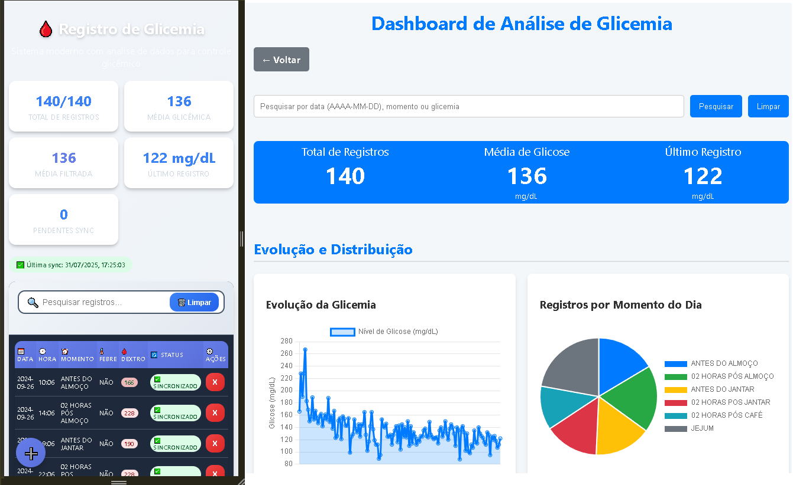

<!-- 
  Tags: DadosIA
  Label: 🩸 Registro de Glicemia
  Description: Sistema moderno com analise de dados para controle glicêmico
  path_hook: hookfigma.hook1
-->

# 🩸 Sistema Registro, controle e análise de Glicemia.

Um sistema moderno e responsivo para controle e análise de dados glicêmicos, desenvolvido com HTML, CSS e JavaScript puro. Oferece funcionalidades avançadas de análise de dados, sincronização com Google Sheets e interface otimizada para dispositivos móveis.



## 📋 Índice

- [Características](#-características)
- [Funcionalidades](#-funcionalidades)
- [Instalação](#-instalação)
- [Configuração](#-configuração)
- [Uso](#-uso)
- [Estrutura do Projeto](#-estrutura-do-projeto)
- [Análises Disponíveis](#-análises-disponíveis)
- [Integração Google Sheets](#-integração-google-sheets)
- [Tecnologias Utilizadas](#-tecnologias-utilizadas)
- [Compatibilidade](#-compatibilidade)
- [Contribuição](#-contribuição)
- [Licença](#-licença)

## ✨ Características

- **Interface Moderna**: Design responsivo com gradientes e animações suaves
- **PWA Ready**: Otimizado para funcionar como aplicativo web progressivo
- **Offline First**: Funciona completamente offline com armazenamento local
- **Análise Avançada**: Dashboard com múltiplos gráficos e estatísticas
- **Sincronização em Nuvem**: Integração opcional com Google Sheets
- **Mobile Optimized**: Interface adaptada para smartphones e tablets
- **Zero Dependências**: Não requer instalação de bibliotecas externas

## 🚀 Funcionalidades

### Registro de Dados
- ✅ Registro de glicemia com data, hora e momento do dia
- ✅ Controle de episódios febris
- ✅ Validação automática de dados
- ✅ Interface intuitiva com botão flutuante

### Visualização e Filtros
- 📊 Tabela responsiva com status de sincronização
- 🔍 Sistema de busca em tempo real
- 📱 Interface otimizada para dispositivos móveis
- 🎨 Badges coloridos para classificação de valores

### Análises Estatísticas
- 📈 Gráfico de evolução temporal
- 🥧 Distribuição por momentos do dia
- 📊 Histograma de valores
- 📅 Análise sazonal por dia da semana
- 🎯 Detecção de picos e vales
- 📋 Recomendações personalizadas

### Sincronização e Backup
- ☁️ Sincronização incremental com Google Sheets
- 💾 Exportação/importação de dados JSON
- 🔄 Status de sincronização em tempo real
- 📥 Carregamento de dados da nuvem

## 🛠️ Instalação

1. **Clone ou baixe os arquivos**:
   ```bash
   git clone [seu-repositorio]
   # ou baixe os arquivos glisemia.html e data_cientist.html
   ```

2. **Abra no navegador**:
   - Abra o arquivo `glisemia.html` em qualquer navegador moderno
   - Nenhuma instalação adicional é necessária

3. **Para usar como PWA**:
   - Acesse via HTTPS (necessário para PWA)
   - Use "Adicionar à tela inicial" no navegador móvel

## ⚙️ Configuração

### Configuração Básica
O sistema funciona imediatamente após abrir o arquivo HTML. Todos os dados são salvos localmente no navegador.

### Configuração Google Sheets (Opcional)

1. **Configure o Google Apps Script**:
   - Acesse [Google Apps Script](https://script.google.com/)
   - Crie um novo projeto
   - Cole o código do backend (disponível no final do arquivo HTML)
   - Configure as variáveis:
     ```javascript
     const SPREADSHEET_ID = 'seu-id-da-planilha';
     const SHEET_NAME = 'glisemia';
     const TOKEN_SECRETO = 'seu-token-secreto-forte';
     ```

2. **Configure o Frontend**:
   - Edite as variáveis no arquivo `glisemia.html`:
     ```javascript
     const GOOGLE_SHEETS_APP_SCRIPT_URL = 'sua-url-do-apps-script';
     const TOKEN_SECRETO = 'mesmo-token-do-backend';
     ```

3. **Permissões**:
   - Autorize o script a acessar Google Sheets
   - Implante o script como webapp com acesso para "Anyone"

## 📖 Uso

### Adicionando Registros
1. Clique no botão flutuante "+" no canto inferior esquerdo
2. Preencha os dados (data e hora são preenchidas automaticamente)
3. Selecione o momento do dia e presença de febre
4. Insira o valor da glicemia
5. Clique em "Adicionar Registro"

### Visualizando Dados
- Use a barra de pesquisa para filtrar registros
- Observe as estatísticas no topo da página
- Verifique o status de sincronização

### Acessando Análises
1. Clique em "Ver Análises" para abrir o dashboard
2. Explore os diferentes gráficos e métricas
3. Use a busca para filtrar análises específicas

### Sincronização
- Use "Sync Incremental" para enviar apenas novos registros
- Use "Carregar do Google" para importar dados da nuvem
- Monitore o status na parte superior da tela

## 📁 Estrutura do Projeto

```
sistema-glicemia/
├── glisemia.html           # Aplicação principal
├── data_cientist.html      # Dashboard de análises
├── README.md              # Esta documentação
└── backend/
    └── apps-script.js     # Código do Google Apps Script
```

### Arquivos Principais

- **`glisemia.html`**: Interface principal para registro e visualização
- **`data_cientist.html`**: Dashboard com análises avançadas e gráficos
- **Código Apps Script**: Backend para integração com Google Sheets

## 📊 Análises Disponíveis

### Estatísticas Básicas
- Total de registros
- Média glicêmica
- Valores mínimo e máximo
- Mediana e desvio padrão

### Gráficos Interativos
- **Evolução Temporal**: Linha do tempo dos valores
- **Distribuição por Momento**: Pizza com frequência por período
- **Histograma**: Distribuição em faixas de valores
- **Sazonalidade**: Médias por dia da semana
- **Tendência**: Análise dos últimos registros

### Análise Diagnóstica
- Detecção de hiperglicemia (>180 mg/dL)
- Detecção de hipoglicemia (<70 mg/dL)
- Identificação de padrões por período
- Recomendações personalizadas

## ☁️ Integração Google Sheets

### Funcionalidades
- **Sincronização Incremental**: Envia apenas registros novos
- **Backup Automático**: Mantém dados seguros na nuvem
- **Controle de Duplicatas**: Evita registros duplicados
- **Ordenação Automática**: Organiza dados por data/hora

### Segurança
- Token de segurança personalizado
- Validação de dados no servidor
- Controle de acesso via Google Apps Script

### Limitações
- Requer conexão com internet para sincronização
- Dependente da disponibilidade do Google Apps Script
- Limitado pelas cotas do Google Apps Script

## 💻 Tecnologias Utilizadas

### Frontend
- **HTML5**: Estrutura semântica e responsiva
- **CSS3**: Gradientes, animações e flexbox/grid
- **JavaScript ES6+**: Lógica da aplicação e manipulação DOM
- **Chart.js**: Biblioteca para gráficos (CDN)
- **Local Storage**: Armazenamento local dos dados

### Backend (Opcional)
- **Google Apps Script**: Servidor para sincronização
- **Google Sheets API**: Armazenamento em nuvem

### Design
- **Design System**: Variáveis CSS customizadas
- **Responsive Design**: Mobile-first approach
- **Dark Mode**: Suporte automático via CSS media queries

## 📱 Compatibilidade

### Navegadores Suportados
- ✅ Chrome 80+
- ✅ Firefox 75+
- ✅ Safari 13+
- ✅ Edge 80+
- ✅ Chrome Mobile
- ✅ Safari Mobile

### Dispositivos
- 📱 Smartphones (iOS/Android)
- 📱 Tablets
- 💻 Desktops/Laptops
- 🖥️ Monitores 4K

### Requisitos Mínimos
- JavaScript habilitado
- Local Storage disponível
- Conexão com internet (apenas para sincronização)

## 🤝 Contribuição

### Como Contribuir
1. Faça um fork do projeto
2. Crie uma branch para sua feature (`git checkout -b feature/AmazingFeature`)
3. Commit suas mudanças (`git commit -m 'Add some AmazingFeature'`)
4. Push para a branch (`git push origin feature/AmazingFeature`)
5. Abra um Pull Request

### Áreas para Contribuição
- 🎨 Melhorias no design/UX
- 📊 Novos tipos de análises
- 🔧 Otimizações de performance
- 📱 Melhorias mobile
- 🌐 Traduções
- 🧪 Testes automatizados

### Diretrizes
- Mantenha compatibilidade com navegadores listados
- Teste em diferentes dispositivos
- Documente novas funcionalidades
- Siga as convenções de código existentes

## 🔒 Privacidade e Segurança

- **Dados Locais**: Informações armazenadas apenas no seu navegador
- **Sincronização Opcional**: Google Sheets apenas se configurado
- **Sem Tracking**: Nenhum dado é enviado para terceiros
- **Token Seguro**: Autenticação personalizada para API

## 📄 Licença

Este projeto está sob a licença MIT. Veja o arquivo `LICENSE` para mais detalhes.

---

## 🆘 Suporte

### Problemas Comuns

**Q: Os dados desapareceram após limpar o navegador**
A: Os dados são salvos no Local Storage. Use a funcionalidade de exportar para fazer backup.

**Q: Sincronização não funciona**
A: Verifique se configurou corretamente o Google Apps Script e se o token está correto.

**Q: Gráficos não aparecem**
A: Certifique-se de ter pelo menos 5 registros para gerar as análises.

---

## 👨‍💻 Autor

[Fabiano Rocha/Fabiuniz](https://github.com/SeuUsuarioGitHub)

## Licença

Este projeto está licenciado sob a [MIT License](LICENSE).
